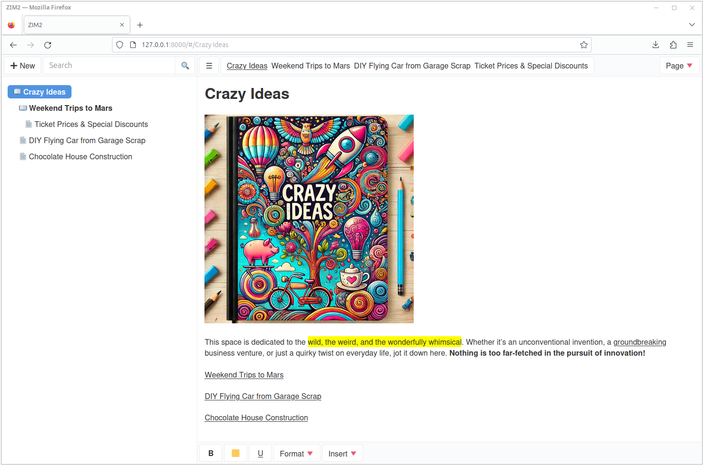
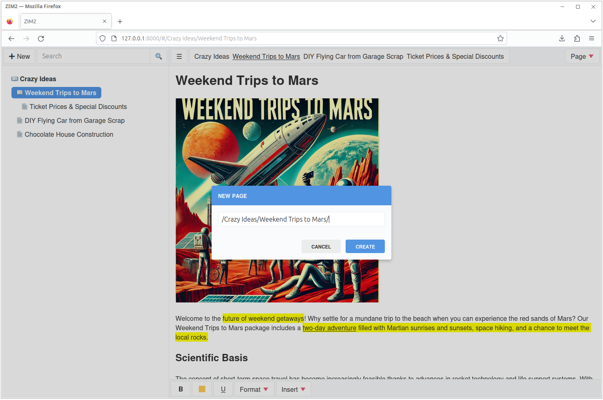
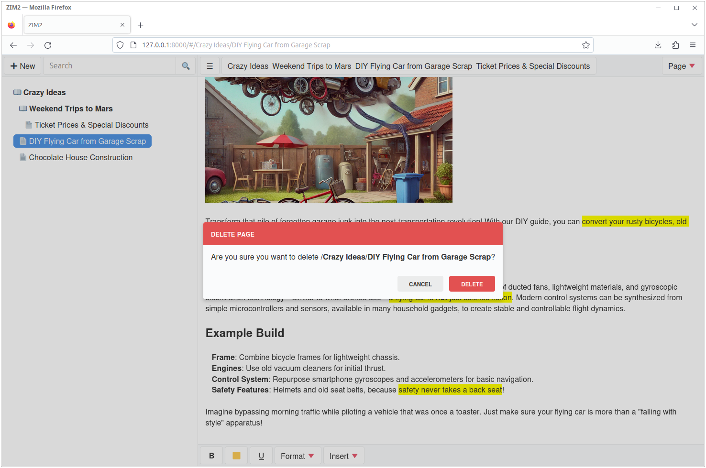
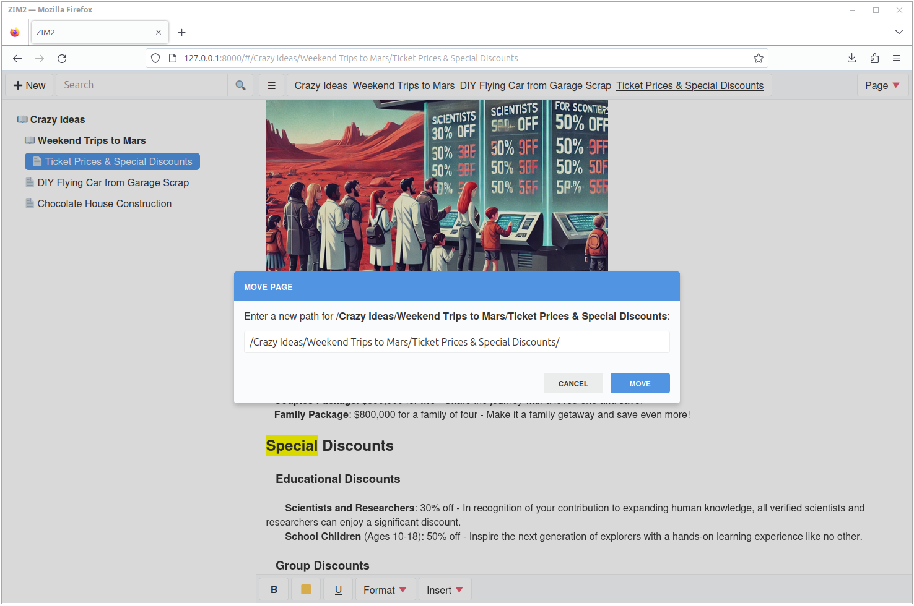
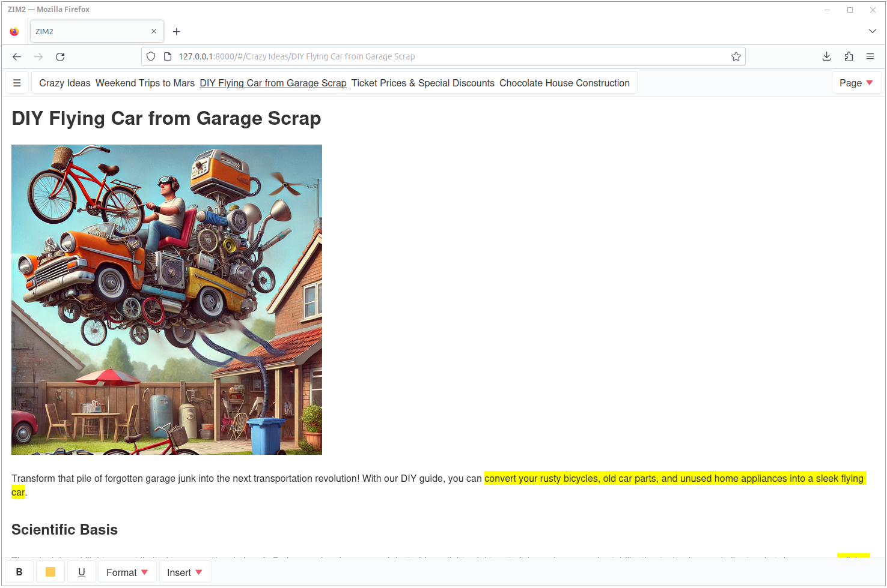

# What is this?

This is a simple note taking app that is inspired by [Zim](https://zim-wiki.org/). It is written in Python and JavaScript. It uses FastAPI for the backend and vanilla JavaScript for the frontend. Under the hood, it uses [Quill](https://quilljs.com/) for the rich text editor and file system for storing notes.

# What does it look like?

Here are some screenshots of the app:



**New Page** dialog:



**Delete Page** dialog:



**Move Page** (and rename) dialog:



Collapsed view:



# Why did you make this?

I use zim extensively for note taking and I wanted to have a web based version of it, so that I can access my notes from anywhere, including my phone.

# Is this ready for production?

No, this is a very early version of the app. It is not ready for production use. It is missing a lot of features and there are a lot of bugs.

# How can I run this?

I put a [makefile](makefile) in the root of the project that has some useful commands. You can run the following command to start the app in development mode:

```bash
% make dev
.venv/bin/uvicorn app.__main__:app
INFO:     Started server process [2239957]
INFO:     Waiting for application startup.
INFO:     Application startup complete.
INFO:     Uvicorn running on http://127.0.0.1:8000 (Press CTRL+C to quit)
...
```

I also put a [docker-compose](docker-compose.yml) file in the root of the project that you can use to run the app in a container. The docker-compose file also includes a certbot container that you can use to generate SSL certificates for the app. You can run the following command to start the app in a container:

```bash
% make up             
docker-compose up --build -d app
Building app
...
Creating zim2_nginx_1 ... done
Creating zim2_app_1   ... done
```

# What are the features of this app?

Create, edit, and delete notes, obviously. You can also create and delete notebooks and search for notes.

# What are the planned features?

To be honest, I do not know. Since this is a side project, I will work on it whenever I have time, which might be never.
